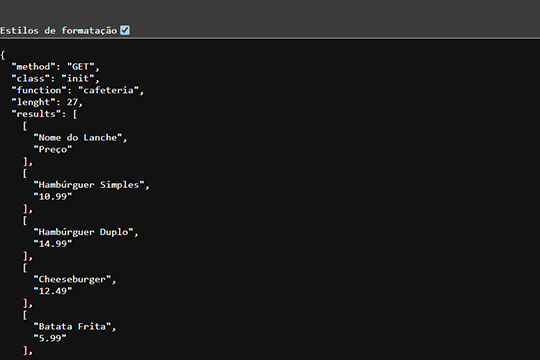

<div align="center">

# API

</div>

## Overview

### Find results by tables .CSV

- This API provides responses in JSON format based on CSV files stored in the `api/ folder`. Requests are made from the application located in the `app/ folder`.

```
root/
 |-- app/               # Client
 |-- api/               # API
```

## Screenshots

<div style="display: flex; flex-wrap: wrap; gap: 10px; justify-content: center;">
  
</div>
